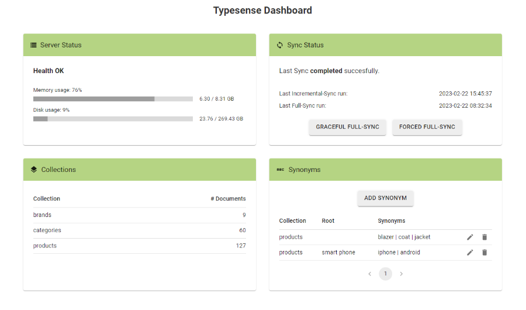

# Typesense plugin 1.0 (Instant Search add-on) for Zen Cart 1.5.7 and 1.5.8
Sync the Zen Cart catalog with a Typesense server and use Typesense as Instant Search engine.

# Features
This plugin is an add-on for the [Instant Search plugin](https://github.com/marco-pm/zencart_instantsearch) and
allows to use [Typesense](https://typesense.org/) as a search engine (in place of MySQL).

- Faster searches and more accurate results than MySQL, including typo tolerance and synonyms.
- Automatic synchronization of the Zen Cart catalog (products, categories and brands) with Typesense.
- Includes a basic dashboard in the Zen Cart admin to monitor the sync status, view Typesense server status and 
  collections, and manage synonyms.
- Automatic fallback to MySQL if the Typesense server is not available.

<br>



# Prerequisites
- Zen Cart 1.5.7 or 1.5.8
- PHP 7.4 through 8.2
- Instant Search plugin 4.0.0 or later
- Typesense server 0.24.0 or later

# Installation, use and FAQs
See the [readme.html](https://htmlpreview.github.io/?https://github.com/marco-pm/zencart_typesense/blob/main/readme.html).

# Troubleshooting
[Zen Cart Forum Support Thread](https://www.zen-cart.com/showthread.php?229326-Typesense-plugin-(Instant-Search-add-on)-Support-Thread)

See also the FAQS & troubleshooting section in the [readme.html](https://htmlpreview.github.io/?https://github.com/marco-pm/zencart_typesense/blob/main/readme.html).

# Development

## Typesense PHP client
The [Typesense PHP client](https://github.com/typesense/typesense-php) is a dependency of this plugin and is not 
included in the repo. To install it:
- copy the vendor files (attached to the GitHub release) in the plugin's directory
- OR, install composer, copy `composer.json` and `composer.lock` in the plugin's directory and run:
  ```
  composer install
  ```

## Admin dashboard
To build the `.js` files from the `.tsx` sources, install Node.js and NPM, then run:
```
npm install

npm run build-typesense_dashboard
```

## TODO
- Consider implementing an optional "frontend search" mode, i.e. sending the search request directly to the Typesense 
  server with JavaScript, without going through the Zen Cart backend.
- Add more features to the admin dashboard, e.g. manage curations.

# Testing
Integration tests use the [Test Framework](https://docs.zen-cart.com/dev/testframework/) of Zen Cart 1.5.8. 
Place the content of the `tests` directory of this repo under `/not_for_release/testFramework`.

Run the tests with:
```
php phpunit --configuration phpunit_typesense.xml
```
